#Current Sales & Price Statistics for California Realtor Single Family Home Sales in May 2018#

##Month to Month (Apr-2018 / May-2018) and Year to Year (May-2017 / May-2018) Price Change and Number of Sales Change for SF Bay Counties and Southern California Counties##

###SFBay Counties and Southern California Counties for sample purpose###

###Los Angeles Metropolitan Area is a 5-county region that includes :### Los Angeles County, Orange County, Riverside County, San Bernardino County, and Ventura County

###S.F. Bay Area has been redefined to include the following counties :### Alameda, Contra Costa, Marin, Napa, San Francisco, San Mateo, Santa Clara, Solano, and Sonoma

*   MTM% Chg = Percent change from prior month
*   YTY% Chg = Percent change from prior year  

##Sample Excel Data of SFH Sales and Price Change##

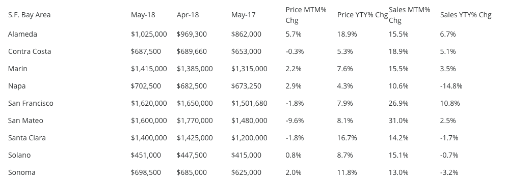

##SF BAY COUNTIES##
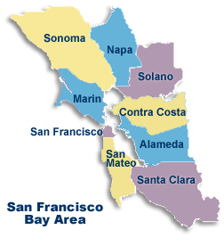

###Import data into Pandas Data Frame : SF Bay Counties###

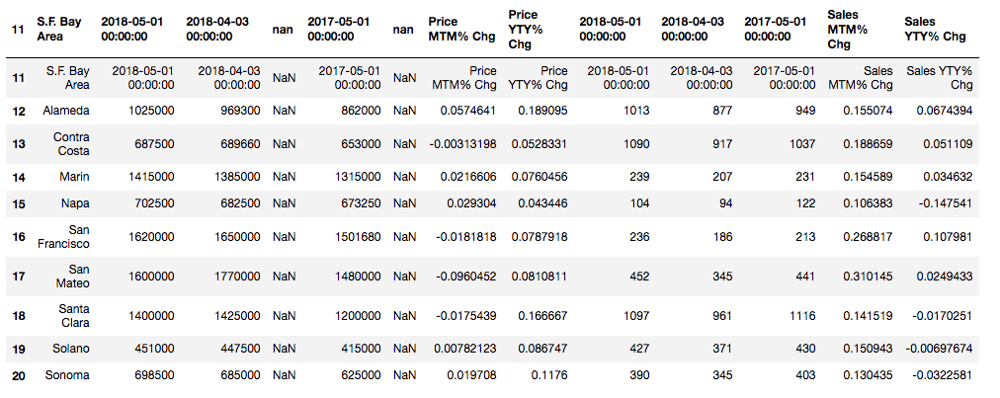

###Clean Up Data : Remove 'nan', change column names, create headers for category, multiply % by 100 to make it out of 100%, change significant figures on % change###

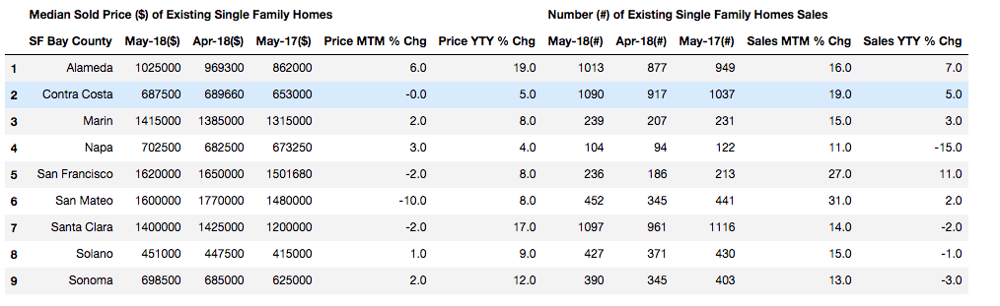

##SF Bay Area: Year to Year Median Sold Price of Existing Single Family Homes (May-2017 / May-2018)##
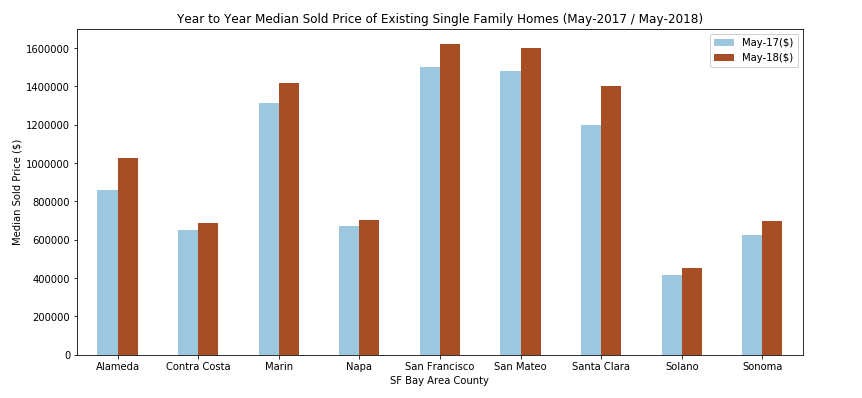

**Price has risen for all counties of SF Bay area from May 2017 to May 2018**
---

##SF Bay Area: Year to Year Price Change % in Existing Single Family Homes (May-2017 / May-2018)##
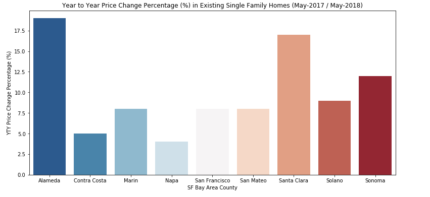

**Almost all counties in SF Bay area has risen by more than 5%**
---

##SF Bay Area: Month to Month Median Sold Price of Existing Single Family Homes (Apr-2018 / May-2018)##
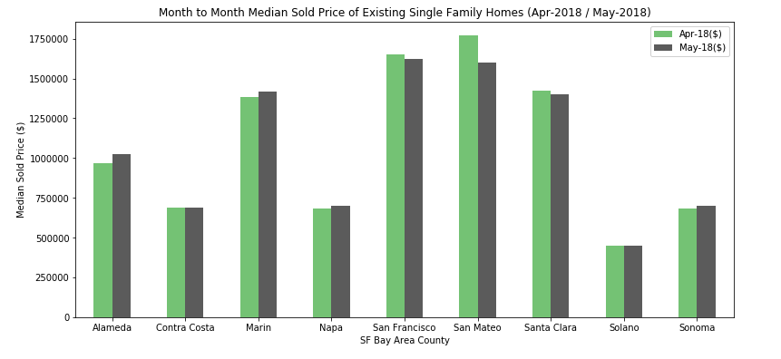

**On a Month to Month basis, some county's prices have dropped slightly**

---

##SF Bay Area: Month to Month % Change in Median Sold Price of Existing Single Family Homes (Apr-2018 / May-2018)##

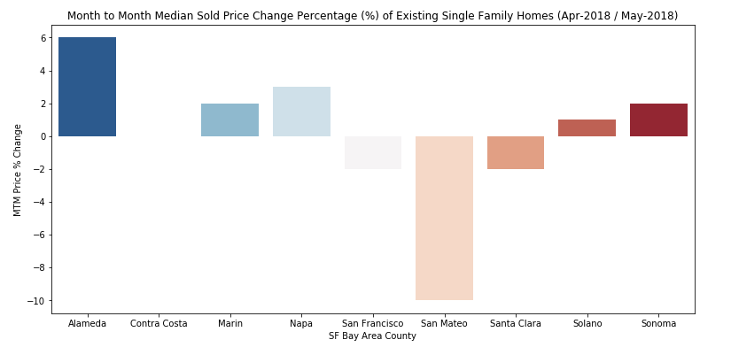

**Some counties' prices had gone up while some have gone down for Month to Month**

---

##SF Bay Area: Year to Year number of Existing Single Family Home Sales (Apr-2018 / May-2018)##

**Number of Sales in SF Bay counties varies Year to Year. Some counties observed increase in number of sales, while some decreased**
---

##SF Bay Area: Year to Year % change in Number of Existing Single Family Home Sales (May-2017 / May-2018)##
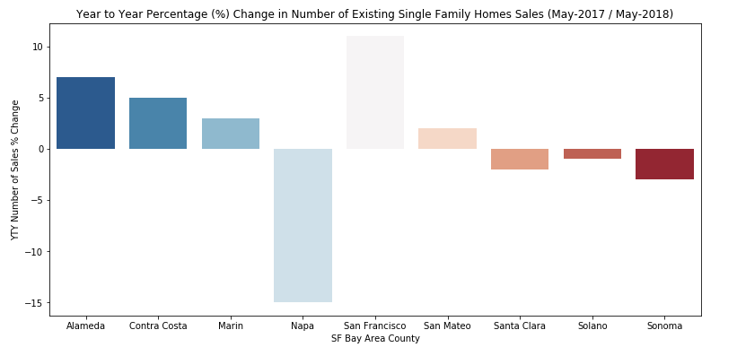

**Napa County has seen almost 15% decrease in number of sales while San Francisco County has seen an increase of almost 10%**
---

##SF Bay Area: Month to Month Number of Existing Single Family Home Sales (Apr-2018 / May-2018)##
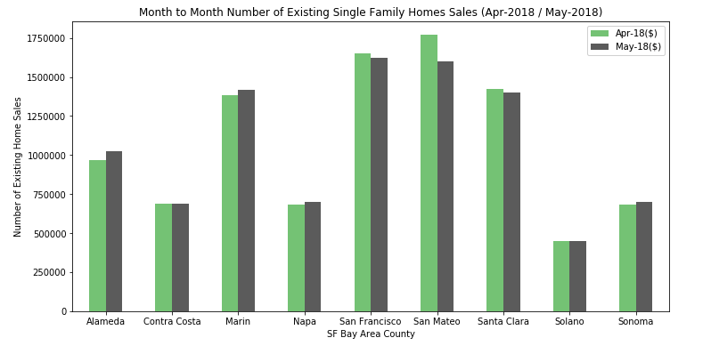

**Month to Month, some counties saw an increase in number of sales while others saw a decrease. San Mateo saw the biggest amount of decrease**

---

##SF Bay Area: Month to Month Percent Change in Number of Existing Single Family Home Sales (Apr-2018 / May-2018)##
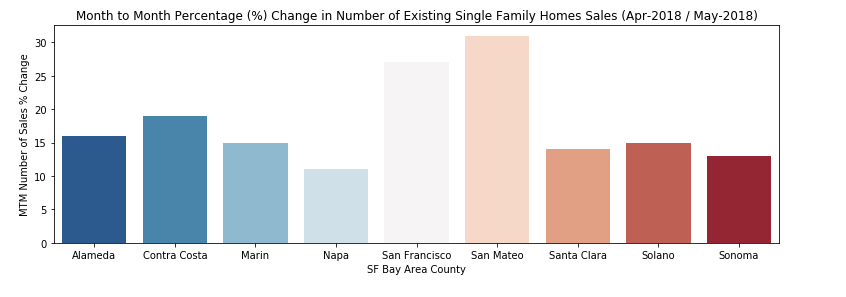

**Month to Month every county in SF Bay has seen an increase of more than 10% in number of sales**

---

##SOUTHERN CALIFORNIA COUNTIES##
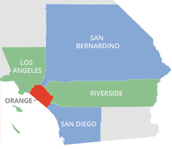

***Import data into Pandas Data Frame : SoCal Counties***

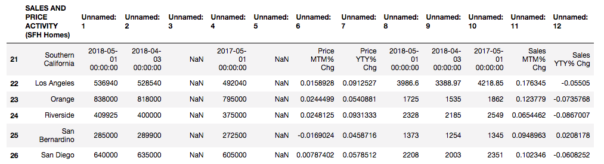

***Clean Up Data : Remove 'nan', change column names, create headers for category, multiply % by 100 to make it out of 100%, change significant figures on % change***

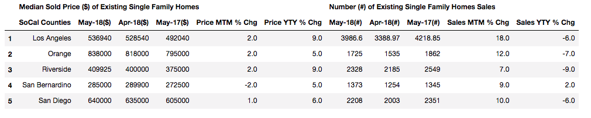

***SoCal Area: Year to Year Median Sold Price of Existing Single Family Homes (May-2017 / May-2018)***
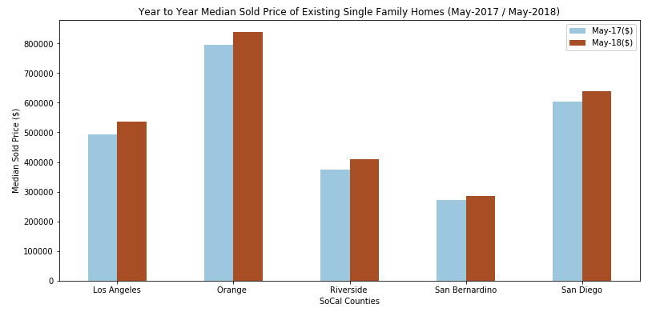

**Price has risen for all counties of SoCal area from May 2017 to May 2018**

***SoCal Area: Year to Year Price Change % in Existing Single Family Homes (May-2017 / May-2018)***
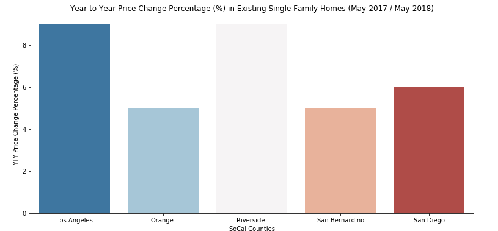

**All counties in SoCal area has risen by more than 4% with Los Angeles and Riverside seeing the highest growth**

***SoCal Area: Month to Month Median Sold Price of Existing Single Family Homes (Apr-2018 / May-2018)***
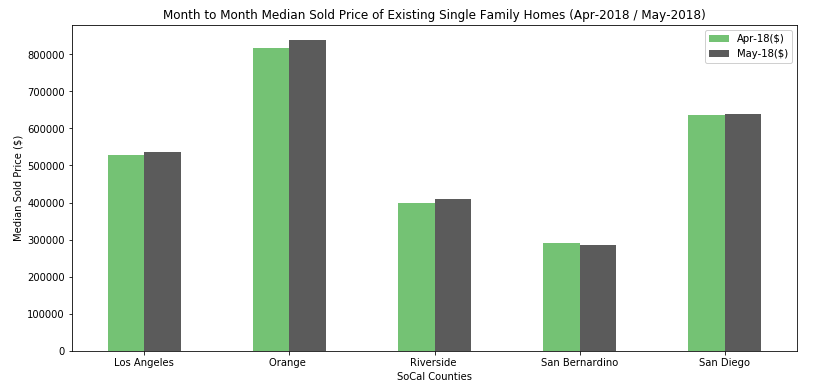

**On a Month to Month basis, almost all counties saw an increase except San Bernardino county**

***SoCal Area: Month to Month % Change in Median Sold Price of Existing Single Family Homes (Apr-2018 / May-2018)***
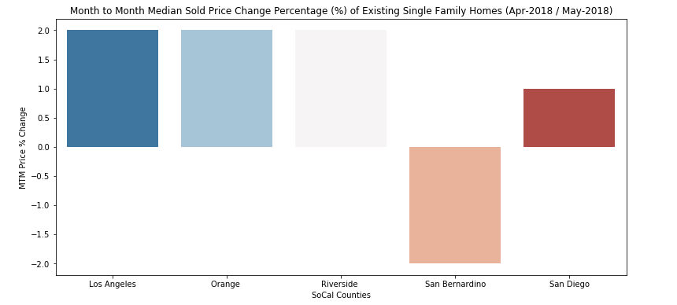

**Almost all SoCal counties saw a rise in price change of 1% or more Month to Month except for San Bernardino which saw a decrease of around 2%**

***SoCal Area: Year to Year number of Existing Single Family Home Sales (Apr-2018 / May-2018)***

**Almost all SoCal counties saw a decrease in number of Existing Home Sales Year to Year except San Bernardino County which saw a small increase**

***SoCal Area: Year to Year % change in Number of Existing Single Family Home Sales (May-2017 / May-2018)***
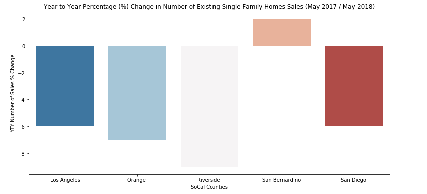

**Except for San Bernardino, which saw around a 2% increase in YTY number of Existing Home Sales, all the other counties saw a decrase of about 6% or more with Riverside seeing the biggest decrease**

***SoCal Area: Month to Month Number of Existing Single Family Home Sales (Apr-2018 / May-2018)***
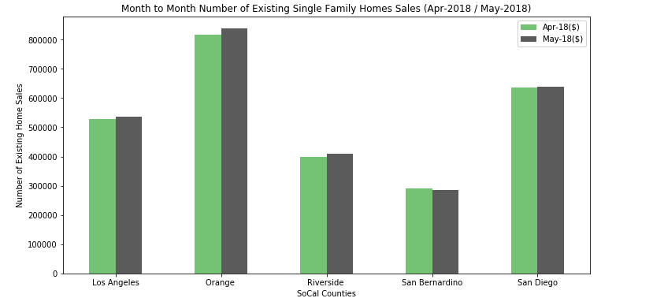

**Month to Month, every county in SoCal saw an increase in number of Existing Home Sales**

***SoCal Area: Month to Month Percent Change in Number of Existing Single Family Home Sales (Apr-2018 / May-2018)***
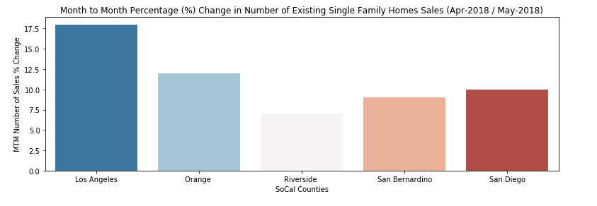

**Month to Month, all SoCal counties saw a 5% or more increase in Existing Home Sales with Los Angeles county seeing the highest around 17.5%**

**This was a mini project in taking an Excel data sheet from the California Realtor's Association website showing YTY and MTM data of various counties all over California**

**For the purpose of keeping this project short, Central California Counties and many other Counties including Central Valley and Inland Empire were not included**

**-The purpose of this mini project was to show how one can take an Excel data sheet from a data source, import and clean up the data using Pandas DataFrame,**
**and using Matplotlib / Seaborn Visualization to create visual plots of the said data in order to be able to visually identity trends and information**
**that's not readily visible just by looking at numbers**

**-Future Data Analysis would include looking at all the counties, seeing the difference in counties and determining which counties had overall increase or decrease in Price Change**
**and % change in Price and Number of Single Family Home Sales. Further analysis can be given to include changes in Condos, and Apartment building otherwise known under category**
**of Residential Income Properties**

