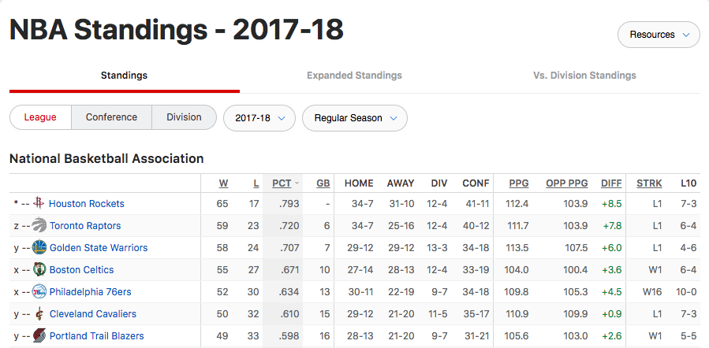
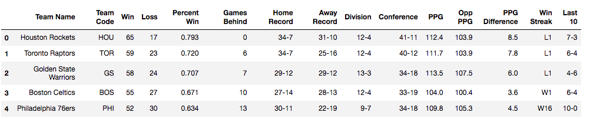
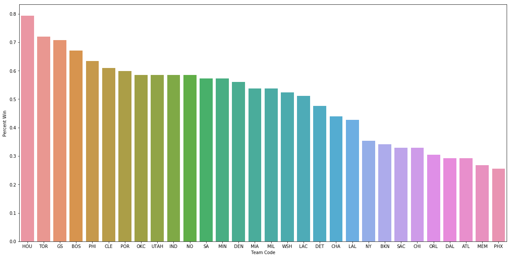
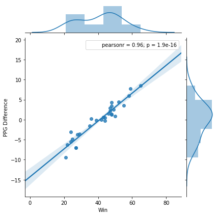

# ESPN NBA Standing 2017-2018 Analysis Using BeautifulSoup, Pandas DataFrame and Seaborn Visualization

This is a mini project that incorporates Webscraping using BeautifulSoup, importing into Pandas DataFrame and using Seaborn to show visualization of scraped data. 
The data was scraped from ESPN website under NBA Standings for the season of 2017-2018, specifically the League Standings. 
Website: http://www.espn.com/nba/standings/_/group/league 

### Sample view of Data Table in ESPN NBA Standings website

### BeautifulSoup was used to scrape the data from the League Standings table and imported into Pandas DataFrame. This is a sample view of the first 5 entries of the DataFrame (head())

## Using Seaborn as Visualization Tool using Pandas DataFrame

### Seaborn Bar Plot showing Team and Winning Percentage for the season in a descending order from left to right
This plot shows the winning percentage of each team for the 2017-2018 season

### Seaborn Joint Plot showing the relationship between Number of Winning Games vs Points Per Game Difference
Here the Points Per Game Difference is the average number of points in games the team beat it's opponents by.
The calculation is based on Points Per Game (PPG) minus Opponent Points Per Game (Opp PPG). Another way of arriving at this number is by (Total Points Scored in Season - Total Points Gave Up in season) / Number of Games.
Higher the PPG difference, the higher margin of score games won by. Lower the PPG difference, the lower margin of score games won by, or lost by.

This plot shows a linear relationship between PPG Difference and the Number of Games Won. It shows that majority of teams won around **40 Games** with a Points Per Game Difference of **± 5 points**, which means they were close games

### Seaborn Violin Plot showing the relationship between Number of Wins vs PPG Difference

This uses the same data but using a different type of plot. In this plot, it shows that teams with 24 games won in the season has PPG Difference ranging from near 0 to around -8.0, teams with 48 wins had PPG Difference ranging from just under 0 to about 6.
The team with 48 wins but had negative PPG difference means although they won a lot of games, there were few games where when they lost, they lost by lot of points, which decreased the PPG difference.

### Seaborn Strip Plot showing the relationship between Number of Wins vs Opponent Points Per Game

This plot looks into the number of games won in the season vs how many points per game average opponents scored. 
This shows that there's no direct relationship but one can infer there is some relatioship between the two. 
For example, the lower number wins, there's a cluster of teams who gave up more than 105 points per game, where as the higher number of wins gave up less than **105** on average.
There are some teams with high number of wins who gave up more than **105 points per game** average so it's difficult to claim there is a direct relationship. 
However, one can infer that in order to win more games, one should give up less points to the other team.

### Matplotlib Stacked Bar Plot showing Number of Wns and Number of Losses compared to Total Games played in the season

This plot shows the Total number of games in the season with Number of Wins stacked on top of Number of Losses. 
This is another way of looking at the amount of games won/lost in the season. As one can see, there's a gradual increase, almost linear, of the amount of games won/lost. 
It seems to be a Linear Regression and no real outliers

### Seaborn Stacked Horizontal Bar Plot showing relationship between Number of Losses vs Opponent Points Per Game for each team
 
 
 
 This plot shows a stacked horizontal bar plot which compares the Number of Losses for each team and the amount of points they gave up (Opp PPG)
 The inner Pastel colored values are the amount of games lost and the darker values are the average score of opponents this season.
 This shows that although Opponent Points Per Game (OppPPG) doesn't vary much, the amount of losses for the team does. There are teams that lost less games but gave up more points and there are teams that lost more games but didn't give up as much points
 
 
 ### This was a mini project utilizing BeautifulSoup, Pandas DataFrame, and Seaborn Visualization to analyze the NBA Standing for 2017-2018 season. 
 
 ### I am a beginner in Data Analysis / Data Science and I understand more analysis can be done in order to fully understand aspects of this season that can be shown through data
 
 ### Things I could have used or improved to create more analysis
 
 - Separating Home Record Wins / Losses, Away Record Wins / Losses, Division Wins / Losses, Conference Wins / Losses to create plots comparing wins / losses for each category
 - Using Win Streak Column and PPG Difference in mid season stats to predict the trend and whether the team will end up in a winning season or losing season
 - Utilizing Home Record / Away Record to quantify which teams play better at Home vs better Away
 - Using Division records and Conference records to determine which Division or Conference is better and has a easier path since teams tend to play more against same division compared to conference
 - Using Expanded Standings data to further determine which division or conference is better / worse and which is easier / harder to play in
 - Using Expanding Standings to analyze how each team did in close games (3 PT Games) vs not as close games (10 PT Games). Also using **VS .500 and Above** teams, **VS Below .500** teams, and Overtime(OT) games to better understand the strength / weakness of each team
 
 
 
 
